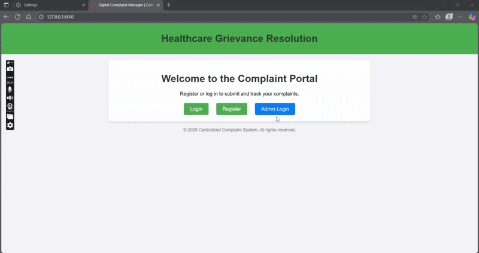

# Digital Complaint Manager(Admin Support)

A robust and feature-rich complaint management system built with the Laravel framework. This application provides a platform for users (such as students and hospital patients) to submit and track complaints, and a powerful administrative dashboard for staff to manage, update, and analyze complaint data.

## Key Features

* **Dual Authentication System**: Separate, secure login portals for regular users and administrators using Laravel's authentication guards.
* **Role-Based Access Control**:
    * **User Panel**: Authenticated users can submit detailed complaints, view their complaint history, and receive status updates.
    * **Admin Panel**: A comprehensive dashboard for administrators to oversee the entire system.
* **Advanced Admin Dashboard**:
    * View and manage all complaints with filtering by college, date, and status.
    * Search functionality for complaints, colleges, and users.
    * At-a-glance statistics for total, pending, in-progress, and resolved complaints.
* **Complaint Management**:
    * Admins can update a complaint's status (Pending, In Progress, Resolved) and add internal notes.
    * Users are notified of status updates in real-time.
* **In-Depth Reporting & Analytics**:
    * A dedicated reports page with data visualizations.
    * Charts for:
        * Complaints by College.
        * Overall Status Breakdown.
        * Complaints Over Time.
        * Complaints by User Role and Sub-Category.
* **Data Export**:
    * Export aggregated complaint reports as a PDF or CSV file.
    * Download a PDF summary for any individual complaint.
* **User & College Management**:
    * View lists of all users and colleges.
    * Filter users who have submitted multiple complaints.
    * View all complaints associated with a specific user or college.
  

## Technology Stack

This project is built using modern web technologies and relies on the following stack:

* **Backend**: PHP ^8.2, Laravel ^11.31
* **Database**: MySQL
* **Real-time Events**: Laravel Reverb / Pusher for WebSocket notifications
* **PDF Generation**: `barryvdh/laravel-dompdf`
* **Frontend**: Vite, Blade Templates

## Prerequisites

Before you begin, ensure you have the following installed on your local machine:
* PHP >= 8.2
* Composer
* Node.js & NPM
* A database server (e.g., MySQL)

## Installation Guide

Follow these steps to get your development environment set up:

1.  **Clone the repository:**
    ```bash
    git clone <your-repository-url>
    cd <repository-directory>
    ```

2.  **Install PHP dependencies:**
    ```bash
    composer install
    ```

3.  **Install JavaScript dependencies:**
    ```bash
    npm install
    ```

4.  **Set up your environment file:**
    * Copy the example environment file. The `post-root-package-install` script in `composer.json` may have already done this for you.
    ```bash
    cp .env.example .env
    ```
    * Generate a new application key:
    ```bash
    php artisan key:generate
    ```

5.  **Configure your `.env` file:**
    * Open the `.env` file and update the `DB_*` variables with your database credentials.
    ```dotenv
    DB_CONNECTION=mysql
    DB_HOST=127.0.0.1
    DB_PORT=3306
    DB_DATABASE=adminpanel
    DB_USERNAME=root
    DB_PASSWORD=
    ```
    * Configure your `APP_URL` to match your local development URL (e.g., `http://127.0.0.1:8000`).

6.  **Run database migrations:**
    * This will create all the necessary tables for the application, including for sessions and queues.
    ```bash
    php artisan migrate
    ```

7.  **(Optional) Seed the database:**
    * If you have database seeders, run them to populate your database with initial data.
    ```bash
    php artisan db:seed
    ```

## Running the Application

1.  **Compile frontend assets:**
    * This command will compile assets and watch for changes.
    ```bash
    npm run dev
    ```

2.  **Start the development server:**
    * The application will be available at `http://127.0.0.1:8000` by default.
    ```bash
    php artisan serve
    ```

3.  **Run the queue worker:**
    * The queue worker is essential for processing background jobs like sending notifications.
    ```bash
    php artisan queue:work
    ```

4.  **Start the Reverb server (for real-time notifications):**
    ```bash
    php artisan reverb:start
    ```

## Usage

The application has two primary points of entry:

* **User Access**:
    * Login: `http://localhost:8000/login`
    * Register: `http://localhost:8000/register`
* **Admin Access**:
    * Login: `http://localhost:8000/admin/login`
    * Dashboard: `http://localhost:8000/admin/dashboard`

You will need to register a user to test the user-facing features and manually create an admin user in the database (`users` table, set `usertype` to 'admin') to access the admin panel.

## License

This project is open-sourced software licensed under the [MIT license](https://opensource.org/licenses/MIT).
